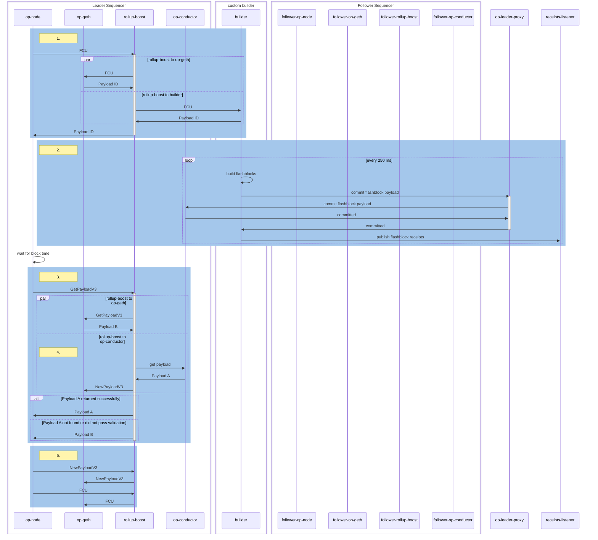

```mermaid
sequenceDiagram
    box Leader Sequencer
        participant op-node
        participant op-geth
        participant rollup-boost
        participant op-conductor
    end
    box custom builder
        participant builder
    end
    box Follower Sequencer
        participant follower-op-node
        participant follower-op-geth
        participant follower-rollup-boost
        participant follower-op-conductor
    end
    participant op-leader-proxy
    participant receipts-listener

    rect rgb(164, 199, 235)
        Note right of op-node: 1.
        op-node ->> rollup-boost: FCU
        activate rollup-boost
            par rollup-boost to op-geth
                rollup-boost ->> op-geth: FCU
                op-geth ->> rollup-boost: Payload ID
            and rollup-boost to builder
                rollup-boost ->> builder: FCU
                builder ->> rollup-boost: Payload ID
            end
            rollup-boost ->> op-node: Payload ID
        deactivate rollup-boost
    end

    rect rgb(164, 199, 235)
        note right of op-node: 2.
        loop every 250 ms
            builder ->> builder: build flashblocks
            builder ->> op-leader-proxy: commit flashblock payload
            activate op-leader-proxy
                op-leader-proxy ->> op-conductor: commit flashblock payload
                op-conductor ->> op-leader-proxy: committed
                op-leader-proxy ->> builder: committed
            deactivate op-leader-proxy
            builder ->> receipts-listener: publish flashblock receipts
        end
    end

    op-node ->> op-node: wait for block time

    rect rgb(164, 199, 235)
        note right of op-node: 3.
        op-node ->> rollup-boost: GetPayloadV3
        activate rollup-boost
            par rollup-boost to op-geth
                rollup-boost ->> op-geth: GetPayloadV3
                op-geth ->> rollup-boost: Payload B
            and rollup-boost to op-conductor
                note left of op-geth: 4. 
                rollup-boost ->> op-conductor: get payload
                op-conductor ->> rollup-boost: Payload A
                rollup-boost ->> op-geth: NewPayloadV3
            end

            alt Payload A returned successfully
                rollup-boost ->> op-node: Payload A
            else Payload A not found or did not pass validation
                rollup-boost ->> op-node: Payload B
            end
        deactivate rollup-boost
    end

    rect rgb(164, 199, 235)
        note right of op-node: 5.
        op-node ->> rollup-boost: NewPayloadV3
        rollup-boost ->> op-geth: NewPayloadV3
        op-node ->> rollup-boost: FCU
        rollup-boost ->> op-geth: FCU
    end
```