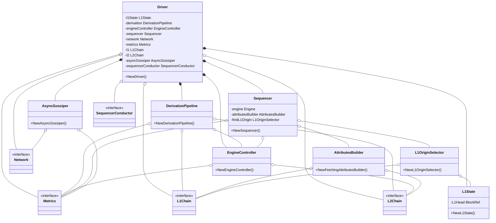

```mermaid
classDiagram
    class Driver {
        -l1State L1State
        -derivation DerivationPipeline
        -engineController EngineController
        -sequencer Sequencer
        -network Network
        -metrics Metrics
        -l1 L1Chain
        -l2 L2Chain
        -asyncGossiper AsyncGossiper
        -sequencerConductor SequencerConductor
        +NewDriver()
    }

    class L1State {
        -L1Head BlockRef
        +NewL1State()
    }

    class DerivationPipeline {
        +NewDerivationPipeline()
    }

    class EngineController {
        +NewEngineController()
    }

    class Sequencer {
        -engine Engine
        -attributesBuilder AttributesBuilder
        -findL1Origin L1OriginSelector
        +NewSequencer()
    }

    class AsyncGossiper {
        +NewAsyncGossiper()
    }

    class Network {
        <<interface>>
    }

    class L1Chain {
        <<interface>>
    }

    class L2Chain {
        <<interface>>
    }

    class Metrics {
        <<interface>>
    }

    class SequencerConductor {
        <<interface>>
    }

    class AttributesBuilder {
        +NewFetchingAttributesBuilder()
    }

    class L1OriginSelector {
        +NewL1OriginSelector()
    }

    Driver *-- L1State
    Driver *-- DerivationPipeline
    Driver *-- EngineController
    Driver *-- Sequencer
    Driver *-- AsyncGossiper
    Driver o-- Network
    Driver o-- L1Chain
    Driver o-- L2Chain
    Driver o-- Metrics
    Driver o-- SequencerConductor

    DerivationPipeline o-- L2Chain
    DerivationPipeline o-- EngineController
    DerivationPipeline o-- Metrics
    DerivationPipeline o-- L1Chain

    EngineController o-- L2Chain
    EngineController o-- Metrics

    Sequencer o-- EngineController
    Sequencer o-- AttributesBuilder
    Sequencer o-- L1OriginSelector
    Sequencer o-- Metrics

    AsyncGossiper o-- Network
    AsyncGossiper o-- Metrics

    AttributesBuilder o-- L1Chain
    AttributesBuilder o-- L2Chain

    L1OriginSelector o-- L1Chain
    L1OriginSelector o-- L1State
```